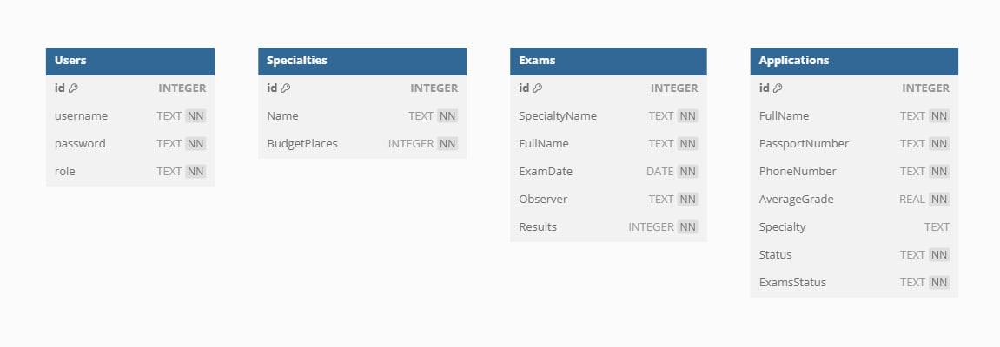

# ApplicationManagementSystem
# Описание
ApplicationManagementSystem - это программное обеспечение, которое помогает учебным заведениям (вузам, колледжам) управлять процессом приема абитуриентов. 
Она автоматизирует и упрощает многие задачи, связанные с приемом, от подачи заявлений до зачисления студентов.
# Функциональность
1. Администратор:
* Добавление редактора, абитуриента, администратора
* Проверка документов
* Управление статусом заявлений
* Просмотр зарегистрированных на вступительные экзамены
* Редактирование зарегистрированных на вступительные экзамены (удалить, добавить)
* Добавление вступительных экзаменов (на которые будут регистрироваться)
* Оценка результатов
* Просмотр рейтинга списков
* Формирование приказа о зачислении
2. Редактор:
* Проверка документов
* Управление статусом заявлений
* Просмотр зарегистрированных на вступительные экзамены
* Оценка результатов
* Просмотр рейтинга списков
* Формирование приказа о зачислении
* Добавить абитуриента
3. Гость:
* Зарегистрироваться

# Используемые технологии:
* WPF - Windows Presentation Foundation для создания графического интерфейса.
* Sqlite - База данных для хранения информации.
* C# - язык программирования
# База данных

# Структура базы данных
База данных SQlite содержит следующие таблицы:
1. Таблица Users:

* id: Хранит уникальный идентификатор пользователя.
* username: Хранит имя пользователя.
* password: Хранит пароль пользователя.
* role: Хранит роль пользователя.

2. Таблица Specialties:

* id: Хранит уникальный идентификатор специальности.
* Name: Хранит название специальности.
* BudgetPlaces: Хранит количество бюджетных мест для специальности).

3. Таблица Exams:

* id: Хранит уникальный идентификатор экзамена.
* SpecialtyName: Хранит название специальности, к которой относится экзамен.
* FullName: Хранит полное имя человека, который сдавал экзамен.
* ExamDate: Хранит дату проведения экзамена.
* Observer: Хранит имя наблюдателя на экзамене.
* Results: Хранит результат экзамена.

4. Таблица Applications:

* id: Хранит уникальный идентификатор заявки.
* FullName: Хранит полное имя заявителя.
* PassportNumber: Хранит номер паспорта заявителя.
* PhoneNumber: Хранит номер телефона заявителя.
* AverageGrade: Хранит средний балл заявителя.
* Specialty: Хранит специальность, на которую подана заявка.
* Status: Хранит текущий статус заявки.
* ExamsStatus: Хранит статус сдачи экзаменов.

# Скриншоты
Скриншоты доступны в папке Screenshots
